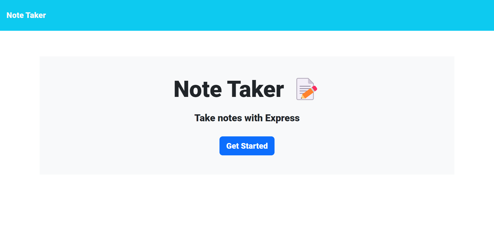
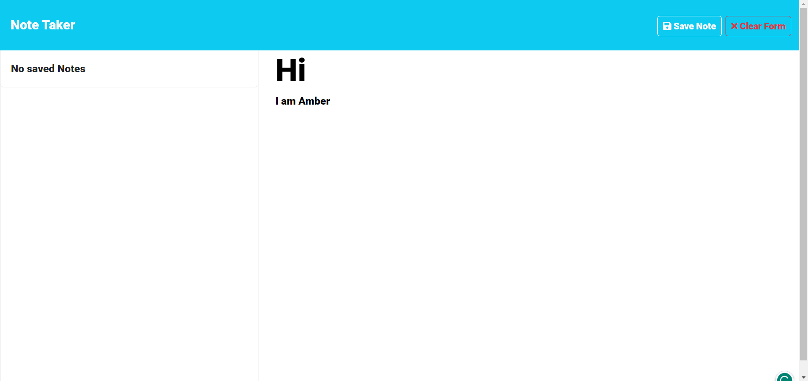

PROJECT TITLE: note-generator

TABLE OF CONTENT
-[LICENSE](#LICENSE)
-[DESCRIPTION](#DESCRIPTION)
-[INSTALLATION](#INSTALLATION)
-[USAGE](#USAGE)
-[CONTRIBUTION GUIDELINES](#CONTRIBUTION-GUIDELINES)
-[TESTS](#TESTS)
-[CONTACT INFORMATION](#CONTACT-INFORMATION)
-[PICTURES](#PICTURES)

# LICENSE
MIT License (2023, Ryan Messett). Permission is hereby granted, free of charge, to any person obtaining a copy of this software and associated documentation files (the "Software"), to deal in the Software without restriction, including without limitation the rights to use, copy, modify, merge, publish, distribute, sublicense, and/or sell copies of the Software, and to permit persons to whom the Software is furnished to do so, subject to the following conditions: The above copyright notice and this permission notice shall be included in all copies or substantial portions of the Software.

# DESCRIPTION
An application the takes, saves and deletes notes. 

# INSTALLATION INFORMATION
  To install all the node dependecies enter npm i, then enter npm run dev and go to port 5000 in your browser.

# USAGE INFORMATION
  In the home page click the button Get Started, then write the note, including title and text so you can save it; finally if you want to delete the note click the trash button on the right side.

# CONTRIBUTION GUIDELINES
  Carolina Sandoval - Server.js

# TESTS
  No tests planned

# CONTACT INFORMATION
For further questions reach me on GitHub and by email.
GITHUB: https://github.com/ambersanti1
EMAIL: carolinasandoval879@gmail.com 

# PICTURES

